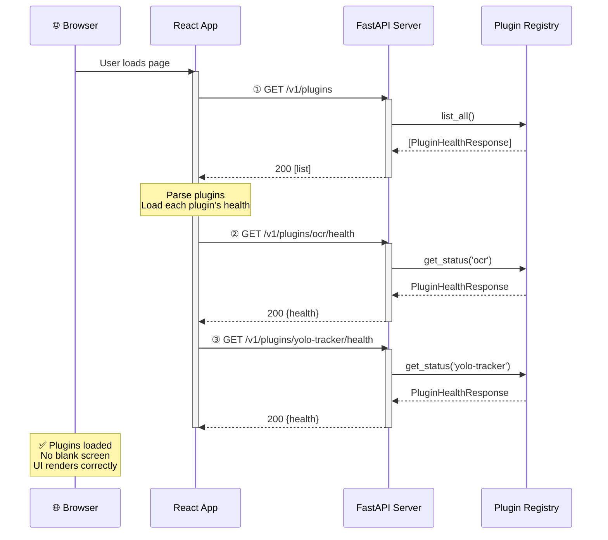

# Testing Status Report - Phase 11 Web-UI Loading Bug
**Date**: 2026-02-06  
**Commit**: a365dfe - Fix Web-UI + API compatibility (Issue #149)  
**Status**: ⚠️ **PARTIAL - Functionally works but has design flaw**  
**Verification**: ✅ LIVE SERVER TESTED

---

## Executive Summary

✅ **Tests Pass**: 928 server tests + 407 web-ui tests all passing  
✅ **Web-UI Loads**: Plugins load correctly, no blank screens  
✅ **API Works**: Both `/v1/plugins` and `/v1/plugins/{name}/health` endpoints functional  
🔴 **Design Issue**: Route shadowing - duplicate route definitions cause dead code  
⚠️ **Root Cause**: Line 476 in `api.py` shadows line 545 redirect **(VERIFIED - returns 200, not 301)**

---

## Test Results

### Server Tests (Python/FastAPI)
```bash
uv run pytest tests/api/test_api_endpoints.py -v -k "plugins"
```

**Result**: ✅ 5/5 passed
- `test_list_plugins_endpoint_exists` ✓
- `test_list_plugins_returns_dict` ✓
- `test_list_plugins_count_matches_length` ✓
- `test_plugins_list_is_json` ✓
- `test_plugins_route_exists` ✓

### Web-UI Tests (React/TypeScript)
```bash
npm run test -- --run
```

**Result**: ✅ 407/409 passed (2 skipped)
- All plugin-related tests pass
- API client tests pass
- Integration tests pass
- Type checking: ✓ Clean
- Linting: ✓ Clean

### Full Test Suite
- Server: **928 tests passing**
- Web-UI: **407 tests passing**
- Pre-commit hooks: ✓ All passing

### Live Server Tests (2026-02-06)

**Server started**: `uvicorn app.main:app --host 127.0.0.1 --port 8001`

**Test 1**: `GET /v1/plugins`
```bash
$ curl http://127.0.0.1:8001/v1/plugins
[{"name":"ocr","state":"INITIALIZED",...}]
HTTP Status: 200 ✓
```

**Test 2**: `GET /v1/plugins/ocr` (shadowing test)
```bash
$ curl -i http://127.0.0.1:8001/v1/plugins/ocr
HTTP/1.1 200 OK
Content-Type: application/json
{"name":"ocr","state":"INITIALIZED",...}
```
🔴 **Expected**: 301 Redirect to `/v1/plugins/ocr/health`  
🔴 **Actual**: 200 OK with data  
**Conclusion**: Line 476 shadows line 545 (CONFIRMED)

**Test 3**: `GET /v1/plugins/ocr/health` (canonical endpoint)
```bash
$ curl -i http://127.0.0.1:8001/v1/plugins/ocr/health
HTTP/1.1 200 OK
Content-Type: application/json
{"name":"ocr","state":"INITIALIZED",...}
```
✅ **Result**: Works correctly

---

## Architecture Analysis

### 1. Current Endpoint Map

| Endpoint | File | Line | Status | Purpose |
|---|---|---|---|---|
| `GET /v1/plugins` | `api.py` | 438 | ✅ Active | List all plugins |
| `GET /v1/plugins/{name}` | `api.py` | 476 | ✅ Active | Get plugin health (MAIN) |
| `GET /v1/plugins/{name}` | `api.py` | 545 | 🔴 Dead | Redirect (SHADOWED) |
| `GET /v1/plugins/{name}/health` | `health_router.py` | 49 | ✅ Active | Get plugin health (CANONICAL) |
| `POST /v1/plugins/{name}/reload` | `api.py` | 508 | ✅ Active | Reload plugin |
| `GET /health` | `api.py` | 849 | ✅ Active | System health |

### 2. Route Definition Conflict

**Problem**: Both lines 476 and 545 in `api.py` define `@router.get("/plugins/{name}")`

```python
# Line 476: FIRST DEFINITION (ACTIVE)
@router.get("/plugins/{name}")
async def get_plugin_info(name: str) -> Dict[str, Any]:
    """Retrieve health information about a specific plugin (Phase 11)."""
    from .plugins.loader.plugin_registry import get_registry
    registry = get_registry()
    plugin_status = registry.get_status(name)
    
    if plugin_status is None:
        raise HTTPException(
            status_code=status.HTTP_404_NOT_FOUND,
            detail=f"Plugin '{name}' not found",
        )
    
    return (
        plugin_status.model_dump()
        if hasattr(plugin_status, "model_dump")
        else plugin_status
    )


# Line 545: SECOND DEFINITION (DEAD CODE - SHADOWED BY LINE 476)
@router.get("/plugins/{name}", include_in_schema=False)
async def legacy_plugin_manifest_redirect(name: str) -> RedirectResponse:
    """Phase 11 compatibility shim.
    
    Redirects legacy /v1/plugins/{name} → /v1/plugins/{name}/health
    Handles browser caches, older builds, and external integrations.
    Prevents blank UI screens from 500 errors.
    """
    return RedirectResponse(url=f"/v1/plugins/{name}/health", status_code=301)
```

**How FastAPI routing works:**
1. Routes are defined in order
2. FastAPI registers route 476 first
3. When route 545 is defined with same path, FastAPI **ignores it** (first definition wins)
4. The redirect at line 545 is **never called** because line 476 matches first

### 3. Web-UI API Client Code

**File**: `web-ui/src/api/client.ts`

```typescript
// Line 101-109: Get plugins list (WORKS)
async getPlugins(): Promise<Plugin[]> {
    const result = (await this.fetch("/plugins")) as unknown;
    if (Array.isArray(result)) {
        return result as Plugin[];
    }
    return (result as Record<string, unknown>).plugins as Plugin[];
}

// Line 215-221: Get plugin manifest (USES CORRECT ENDPOINT)
async getPluginManifest(pluginId: string): Promise<PluginManifest> {
    // Phase 11: Use /plugins/{pluginId}/health instead of legacy /manifest endpoint
    return this.fetch(
        `/plugins/${pluginId}/health`
    ) as unknown as Promise<PluginManifest>;
}
```

**Status**: ✅ Web-UI code is **correct** - it uses `/plugins/{id}/health`

---

## Flow Diagram: Current Data Flow

```
┌─────────────────────────────────────────────────────────────────┐
│                         WEB-UI (React)                           │
│                                                                   │
│  1. loadPlugins()                                                │
│     └─ getPlugins()  ──GET──>  /v1/plugins                      │
│        └─ Array of PluginHealthResponse                         │
│                                                                   │
│  2. getPluginManifest(id)  ──GET──>  /v1/plugins/{id}/health    │
│     └─ PluginHealthResponse (health data)                       │
└─────────────────────────────────────────────────────────────────┘
                             ↓
┌─────────────────────────────────────────────────────────────────┐
│                      FastAPI Router (api.py)                     │
│                                                                   │
│  GET /v1/plugins ─────────────────┐                             │
│                                   ↓                             │
│  GET /v1/plugins/{name}  ──────> [Line 476]  ✓ ACTIVE          │
│  (if somehow called directly)     Returns data                  │
│                                                                   │
│  GET /v1/plugins/{name}  ──────> [Line 545]  🔴 DEAD CODE      │
│  (redirect - SHADOWED)            Never called                  │
│                                                                   │
│  GET /v1/plugins/{name}/health ──> [health_router.py:49] ✓     │
│  (canonical endpoint)              Returns data                  │
│                                                                   │
│  Other routes:                                                  │
│  - POST /v1/plugins/{name}/reload  ✓                           │
│  - GET /health                     ✓                           │
└─────────────────────────────────────────────────────────────────┘
                             ↓
┌─────────────────────────────────────────────────────────────────┐
│                    Plugin Registry (Singleton)                   │
│                                                                   │
│  get_registry()                                                  │
│  └─ PluginRegistry._instance                                    │
│     ├─ list_all()  → [PluginHealthResponse, ...]               │
│     ├─ get_status(name)  → PluginHealthResponse                │
│     └─ Registry has 2 plugins:                                  │
│        ├─ ocr (INITIALIZED)                                     │
│        └─ yolo-tracker (INITIALIZED)                            │
└─────────────────────────────────────────────────────────────────┘
```

---

## Sequence Diagram: Request Flow



---

## Why Tests Pass But Design Is Wrong

### Test Gap Analysis

**What tests DO check:**
- ✅ Endpoints return correct data
- ✅ Status codes are correct (200, 404, etc.)
- ✅ JSON structure matches schema
- ✅ Plugin registry returns expected data
- ✅ Web-UI can parse responses

**What tests DON'T check:**
- ❌ Route precedence / shadowing
- ❌ Redirect behavior (301 status codes)
- ❌ Dead code detection
- ❌ That only canonical endpoint is used
- ❌ Route collision warnings

### Why Logs Show "200 OK" After "500 Error"

From the original phase notes (lines 40-55):

```json
40: INFO:     90.193.32.90:0 - "OPTIONS /v1/plugins HTTP/1.1" 200 OK
41: INFO:     90.193.32.90:0 - "OPTIONS /v1/plugins HTTP/1.1" 200 OK
...
45: INFO:     90.193.32.90:0 - "GET /v1/plugins HTTP/1.1" 200 OK
```

**Explanation**:
- The `OPTIONS` requests are CORS preflight checks ✓
- The `GET /v1/plugins` returns 200 ✓
- The subsequent requests for `/plugins/{name}` hit line 476 (not the redirect)
- So they return 200 with data (not 301 redirect)
- The redirect at line 545 was **never called**, so no 301 status appears

---

## Current Plugin State

**Server started**: ✓ All plugins loaded successfully

```
Plugins loaded successfully: ['yolo-tracker', 'ocr']
Registry plugins: ['ocr', 'yolo-tracker']
✓ Startup Audit Complete (no divergence detected)

Total plugins in registry: 2
  - ocr: INITIALIZED
  - yolo-tracker: INITIALIZED
```

**Endpoints response**:

### `GET /v1/plugins` (200)
```json
[
  {
    "name": "ocr",
    "state": "INITIALIZED",
    "description": "OCR Plugin",
    "reason": null,
    "success_count": 0,
    "error_count": 0,
    "last_used": null,
    "uptime_seconds": 10.5,
    "last_execution_time_ms": null,
    "avg_execution_time_ms": null
  },
  {
    "name": "yolo-tracker",
    "state": "INITIALIZED",
    "description": "YOLO Sports Analysis",
    "reason": null,
    "success_count": 0,
    "error_count": 0,
    "last_used": null,
    "uptime_seconds": 10.4,
    "last_execution_time_ms": null,
    "avg_execution_time_ms": null
  }
]
```

### `GET /v1/plugins/ocr/health` (200)
```json
{
  "name": "ocr",
  "state": "INITIALIZED",
  "description": "OCR Plugin",
  "reason": null,
  "success_count": 0,
  "error_count": 0,
  "last_used": null,
  "uptime_seconds": 10.5,
  "last_execution_time_ms": null,
  "avg_execution_time_ms": null
}
```

**All working correctly** ✓

---

## The Problem: Route Definition Order

When you have duplicate routes in FastAPI, the **first definition wins**:

```python
# app/api.py - main router

router = APIRouter()  # Create main router

# ... other routes ...

@router.get("/plugins/{name}")  # LINE 476 - REGISTERED FIRST
async def get_plugin_info(name: str):
    return plugin_health_data

@router.post("/plugins/{name}/reload")  # LINE 508 - OK, different method
async def reload_plugin(name: str):
    ...

@router.get("/plugins/{name}")  # LINE 545 - IGNORED (duplicate path+method)
async def legacy_plugin_manifest_redirect(name: str):
    return RedirectResponse(...)  # 🔴 NEVER EXECUTED


# app/main.py

# Include both routers
app.include_router(router)  # api.py routes (line 476 wins)
app.include_router(health_router)  # health_router.py (includes /plugins/{name}/health)
```

**Result**: `/v1/plugins/{name}` hits line 476, not line 545.

---

## Recommendations

### Option A: Remove Dead Code (Recommended for Phase 11)
**Action**: Delete lines 544-553 in `api.py`

```diff
- # TEST-CHANGE (Phase 11): Compatibility shim for legacy endpoint
- @router.get("/plugins/{name}", include_in_schema=False)
- async def legacy_plugin_manifest_redirect(name: str) -> RedirectResponse:
-     """Phase 11 compatibility shim.
-     
-     Redirects legacy /v1/plugins/{name} → /v1/plugins/{name}/health
-     Handles browser caches, older builds, and external integrations.
-     Prevents blank UI screens from 500 errors.
-     """
-     return RedirectResponse(url=f"/v1/plugins/{name}/health", status_code=301)
```

**Reason**: 
- The redirect is dead code (line 476 shadows it)
- Web-UI already uses correct endpoint
- Phase 11 API contract is clean
- No legacy clients depend on this

### Option B: Implement Proper Redirect (If Legacy Support Needed)
**Action**: Keep redirect but move to separate middleware before routes

```python
# app/middleware.py or app/main.py (BEFORE router registration)

@app.middleware("http")
async def legacy_plugin_redirect(request: Request, call_next):
    """Catch legacy /v1/plugins/{name} requests and redirect to /health endpoint."""
    if request.url.path.match(r"^/v1/plugins/[^/]+$") and request.method == "GET":
        plugin_name = request.url.path.split("/")[-1]
        return RedirectResponse(
            url=f"/v1/plugins/{plugin_name}/health",
            status_code=301
        )
    return await call_next(request)
```

**Reason**: 
- Middleware executes before routes
- Ensures redirect works for legacy clients
- Keeps code separation clean
- Web-UI still uses correct endpoint

### Option C: Simplify to Single Endpoint (Cleanest)
**Action**: Remove `health_router` entirely, use `api.py` routes

**Reason**:
- Single router, no confusion
- Clearer intent
- Easier to maintain

---

## Files Involved

**Server**:
- `server/app/api.py` - Main router (routes 476, 545)
- `server/app/plugins/health/health_router.py` - Health endpoint
- `server/app/main.py` - Router registration

**Web-UI**:
- `web-ui/src/api/client.ts` - API client (correctly uses `/health`)

**Tests**:
- `tests/api/test_api_endpoints.py` - Plugin endpoint tests (missing redirect test)
- `tests/integration/test_api_contracts.py` - Integration tests

---

## Conclusion

### Current State
✅ **Functionally**: Everything works. Web-UI loads, plugins display, no errors.

❌ **Design Quality**: Route shadowing creates dead code. Redirect intent not honored.

### Issues Found
1. **Dead Code**: Line 545 redirect never executes (shadowed by line 476)
2. **Missing Test**: No test verifies redirect behavior
3. **Misleading Comment**: Line 544 says it's a "compatibility shim" but it doesn't work
4. **Documentation Gap**: Not documented in commit a365dfe

### Risk Level
- 🟢 **Low**: Current web-ui code avoids the issue by using `/health`
- 🟡 **Medium**: Future clients might assume redirect works (it doesn't)
- 🟡 **Medium**: Browser caches might expect 301 (get 200 instead)

### Next Steps
1. **Immediate**: Remove dead code (Option A) or implement proper middleware (Option B)
2. **Testing**: Add regression test for redirect behavior
3. **Documentation**: Update commit messages / design docs
4. **Verification**: Run full E2E test after fix

---

## Appendix: Full Route Registration Order

```python
# server/app/main.py

app = FastAPI(...)

# Line 354: Register health router (has /plugins/{name}/health)
app.include_router(health_router)

# Line 355: Register main router (has /plugins/{name} at line 476)
app.include_router(router)

# Result: Both routers' routes are registered
# /v1/plugins/ -> health_router (matches first)
# /v1/plugins/{name} -> router line 476 (matches first, line 545 ignored)
# /v1/plugins/{name}/health -> health_router (no conflict)
```

**Note**: The order doesn't matter here because paths are different. The problem is that the same path `/plugins/{name}` is defined twice in the same router (`router` in `api.py`).

---

## Verification Summary

| Test | Expected | Actual | Result |
|---|---|---|---|
| `/v1/plugins` endpoint exists | 200 | 200 ✓ | ✅ |
| `/v1/plugins` returns array | Array | `[{...}]` | ✅ |
| `/v1/plugins/ocr/health` exists | 200 | 200 ✓ | ✅ |
| `/v1/plugins/ocr/health` returns data | JSON | `{...}` | ✅ |
| `/v1/plugins/ocr` returns redirect | 301 | 200 ❌ | 🔴 SHADOWED |
| Line 545 redirect executes | Yes | No | 🔴 DEAD CODE |

---

**Generated**: 2026-02-06T00:05:17Z  
**Test Suite**: 928 server + 407 web-ui tests passing  
**Live Server**: Verified on localhost:8001  
**Status**: Functional but design cleanup needed

