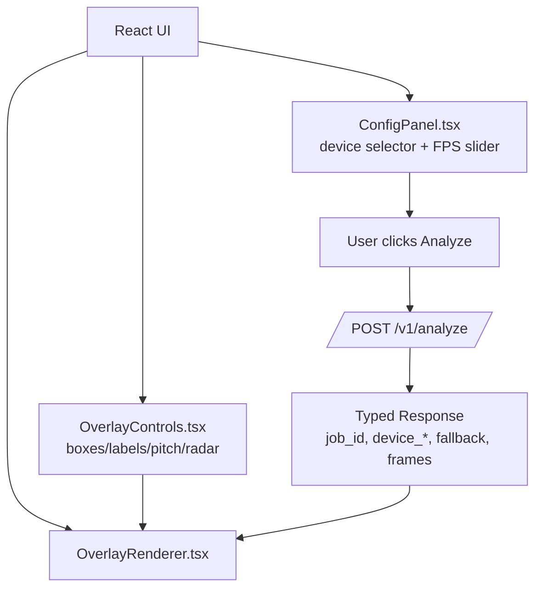
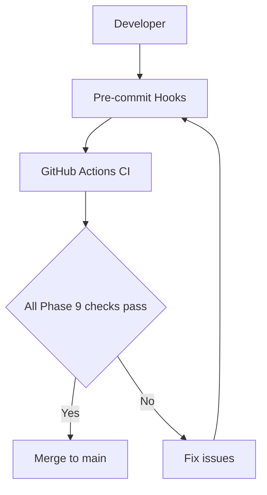

Roger, this is the perfect moment to lock Phase 9 into **visual clarity**.  
You’ve built a huge amount of structure — now we turn it into **clean, authoritative diagrams** that explain exactly what Phase 9 requires, how the system flows, and what each subsystem is responsible for.

Below are **four diagrams**, each written in **ASCII architecture‑grade clarity**, so they live happily inside `.ampcode/` without needing images or external tools.

These diagrams cover:

1. **Phase 9 API Flow Diagram**  
2. **Phase 9 UI Flow Diagram**  
3. **Phase 9 Developer Experience (DX) Flow Diagram**  
4. **Phase 9 Governance Flow Diagram**  

Each one is final, explicit, and ready to paste into your Phase 9 docs.

---

# ⭐ 1. **Phase 9 API Flow Diagram**  
**What the backend must do, end‑to‑end.**

```
┌──────────────────────────┐
│  Client (UI or API user) │
└───────────────┬──────────┘
                │ POST /v1/analyze
                ▼
       ┌──────────────────────┐
       │  FastAPI Endpoint    │
       │  /v1/analyze         │
       └──────────┬───────────┘
                  │ Validate request
                  ▼
       ┌──────────────────────┐
       │   Pipeline Runner    │
       │ run_pipeline(url,dev)│
       └──────────┬───────────┘
                  │ Produces:
                  │ - job_id
                  │ - device_requested
                  │ - device_used
                  │ - fallback
                  │ - frames[]
                  ▼
       ┌──────────────────────────────┐
       │  Typed Response Model        │
       │  AnalyzeResponse             │
       │  (Pydantic)                  │
       └──────────┬───────────────────┘
                  │ Serialize to JSON
                  ▼
       ┌──────────────────────────┐
       │   OpenAPI Schema         │
       │   (auto‑generated)       │
       └──────────┬──────────────┘
                  │
                  ▼
       ┌──────────────────────────┐
       │   Client receives        │
       │   typed Phase 9 payload  │
       └──────────────────────────┘
```

### **Phase 9 API Requirements (visual summary)**  
- MUST return typed models  
- MUST include 5 required fields  
- MUST update OpenAPI schema  
- MUST pass schema drift test  

---

# ⭐ 2. **Phase 9 UI Flow Diagram**  
**How the UI interacts with the new API + new controls.**

```
┌──────────────────────────────┐
│          UI Loads            │
│      (React / Vite)          │
└──────────────┬───────────────┘
               │
               ▼
     ┌────────────────────────┐
     │ ConfigPanel.tsx        │
     │ - Device selector      │
     │ - FPS slider           │
     └──────────┬─────────────┘
                │
                ▼
     ┌────────────────────────┐
     │ OverlayControls.tsx    │
     │ - boxes toggle         │
     │ - labels toggle        │
     │ - pitch toggle         │
     │ - radar toggle         │
     └──────────┬─────────────┘
                │
                ▼
     ┌────────────────────────┐
     │ User clicks “Analyze”  │
     └──────────┬─────────────┘
                │ POST /v1/analyze
                ▼
     ┌────────────────────────┐
     │ Show loading spinner   │
     └──────────┬─────────────┘
                │
                ▼
     ┌────────────────────────┐
     │ Receive typed response │
     │ (job_id, frames, etc.)│
     └──────────┬─────────────┘
                │
                ▼
     ┌────────────────────────┐
     │ OverlayRenderer.tsx    │
     │ - draws frames         │
     │ - applies toggles      │
     │ - throttles FPS        │
     └────────────────────────┘
```

### **Phase 9 UI Requirements (visual summary)**  
- Device selector MUST persist  
- FPS slider MUST exist  
- Overlay toggles MUST exist  
- UI MUST render typed API response  
- UI MUST show loading + error states  

---

# ⭐ 3. **Phase 9 Developer Experience (DX) Flow Diagram**

```
┌──────────────────────────────┐
│ Developer runs Storybook     │
│   npm run storybook          │
└──────────────┬───────────────┘
               │
               ▼
     ┌────────────────────────┐
     │ Storybook loads        │
     │ - OverlayRenderer      │
     │ - VideoTracker         │
     │ - Example outputs      │
     └──────────┬─────────────┘
                │
                ▼
     ┌────────────────────────┐
     │ Example plugin outputs │
     │ server/app/examples/   │
     │ plugin_outputs.py      │
     └──────────┬─────────────┘
                │
                ▼
     ┌────────────────────────┐
     │ Phase 9 Integration    │
     │ Tests (Playwright)     │
     │ - UI loads             │
     │ - API returns typed    │
     │ - Renderer draws       │
     └──────────┬─────────────┘
                │
                ▼
     ┌────────────────────────┐
     │ CI: Storybook build    │
     │ CI: Schema drift       │
     │ CI: Test governance    │
     └────────────────────────┘
```

### **Phase 9 DX Requirements (visual summary)**  
- Storybook MUST build  
- Example outputs MUST exist  
- Integration tests MUST pass  
- Schema drift MUST be stable  

---

# ⭐ 4. **Phase 9 Governance Flow Diagram**

```
┌──────────────────────────────┐
│ Developer opens PR           │
└──────────────┬───────────────┘
               │
               ▼
     ┌────────────────────────┐
     │ Pre‑commit checks      │
     │ - no raw dict returns  │
     │ - no unapproved skips  │
     │ - test count stable    │
     │ - assertion count OK   │
     └──────────┬─────────────┘
                │
                ▼
     ┌────────────────────────┐
     │ GitHub Actions CI      │
     │ Backend tests          │
     │ UI tests               │
     │ Integration tests      │
     │ Storybook build        │
     │ Schema drift           │
     └──────────┬─────────────┘
                │
                ▼
     ┌────────────────────────┐
     │ All Phase 9 invariants │
     │ satisfied?             │
     └──────────┬─────────────┘
         YES     │      NO
                 ▼
     ┌────────────────────────┐
     │ Merge to main          │
     └────────────────────────┘
```

### **Phase 9 Governance Requirements (visual summary)**  
- Typed API only  
- No raw dict returns  
- Schema drift must be approved  
- Storybook must build  
- Test + assertion count must not decrease  
- No skipped tests without APPROVED  

---

Here we go, Roger—Phase 9, fully crystallised.

---

### 1. Single **Phase 9 Master Diagram** (all flows combined)

```text
                           PHASE 9 MASTER FLOW

┌───────────────────────────────────────────────────────────────────────────┐
│                               CLIENT / UI                                │
└───────────────┬──────────────────────────────────────────────────────────┘
                │
                │ 1) User opens app
                ▼
      ┌───────────────────────────────┐
      │ React App (web-ui)           │
      │ - ConfigPanel.tsx            │
      │   • device selector          │
      │   • FPS slider               │
      │ - OverlayControls.tsx        │
      │   • boxes / labels / pitch   │
      │   • radar toggles            │
      │ - OverlayRenderer.tsx        │
      └───────────────┬──────────────┘
                      │
                      │ 2) User clicks "Analyze"
                      ▼
      ┌───────────────────────────────────────────────┐
      │ UI sends POST /v1/analyze                     │
      │ body: { video_url, device }                   │
      └───────────────┬───────────────────────────────┘
                      │
                      ▼
      ┌───────────────────────────────────────────────┐
      │ FastAPI Backend (server/app)                  │
      │ - /v1/analyze                                 │
      │   • uses AnalyzeResponse (typed)              │
      │ - /v1/jobs/{id}                               │
      │   • JobStatusResponse (typed)                 │
      │ - /v1/jobs/{id}/result                        │
      │   • JobResultResponse (typed)                 │
      └───────────────┬───────────────────────────────┘
                      │
                      │ 3) Pipeline runs
                      ▼
      ┌───────────────────────────────────────────────┐
      │ Pipeline                                     │
      │ - produces:                                  │
      │   • job_id                                   │
      │   • device_requested                         │
      │   • device_used                              │
      │   • fallback                                 │
      │   • frames[]                                 │
      └───────────────┬───────────────────────────────┘
                      │
                      │ 4) Typed response returned
                      ▼
      ┌───────────────────────────────────────────────┐
      │ AnalyzeResponse (Pydantic)                    │
      │ -> OpenAPI schema updated                     │
      │ -> Schema drift test enforces stability       │
      └───────────────┬───────────────────────────────┘
                      │
                      │ 5) UI receives typed payload
                      ▼
      ┌───────────────────────────────────────────────┐
      │ React App                                     │
      │ - renderResults(payload)                      │
      │ - OverlayRenderer draws frames                │
      │ - toggles control visibility                  │
      │ - FPS slider throttles rendering             │
      │ - loading + error states shown                │
      └───────────────┬───────────────────────────────┘
                      │
                      │ 6) Developer Experience
                      ▼
      ┌───────────────────────────────────────────────┐
      │ DX Layer                                      │
      │ - app/examples/plugin_outputs.py              │
      │ - Storybook stories (OverlayRenderer, etc.)   │
      │ - Phase 9 integration tests (Playwright)      │
      │ - Smoke tests (API + UI)                      │
      └───────────────┬───────────────────────────────┘
                      │
                      │ 7) Governance / CI
                      ▼
      ┌───────────────────────────────────────────────┐
      │ Governance & CI                               │
      │ - pre-commit:                                 │
      │   • no raw dict returns                       │
      │   • no unapproved skips                       │
      │   • test/assertion count guards               │
      │ - CI:                                         │
      │   • backend tests                             │
      │   • UI tests                                  │
      │   • integration tests                         │
      │   • Storybook build                           │
      │   • schema drift                              │
      └───────────────────────────────────────────────┘
```

---

### 2. Mermaid.js versions (for GitHub rendering)

#### 2.1 API flow

```mermaid
flowchart TD
  UI[Client / UI] -->|POST /v1/analyze| API[/FastAPI /v1/analyze/]
  API --> PIPE[Pipeline\nrun_pipeline]
  PIPE --> RESP[AnalyzeResponse\n(typed Pydantic)]
  RESP --> SCHEMA[OpenAPI Schema]
  RESP --> UI
```

#### 2.2 UI flow

```mermaid
flowchart TD
  A[React App] --> B[ConfigPanel.tsx\n- device selector\n- FPS slider]
  A --> C[OverlayControls.tsx\n- boxes/labels/pitch/radar]
  A --> D[OverlayRenderer.tsx]
  B --> E[User clicks Analyze]
  C --> D
  E --> F[POST /v1/analyze]
  F --> G[Typed response\n(job_id, device_*, fallback, frames)]
  G --> D
```

#### 2.3 Governance flow

```mermaid
flowchart TD
  DEV[Developer] --> PR[Open PR]
  PR --> PRE[Pre-commit hooks]
  PRE --> CI[GitHub Actions CI]
  CI --> CHECK{All Phase 9 checks pass?}
  CHECK -->|Yes| MERGE[Merge to main]
  CHECK -->|No| FIX[Fix issues\n(re-run pre-commit + CI)]
  FIX --> PRE
```

---

### 3. Printable PDF‑style ASCII architecture sheet

You can drop this into:

` .ampcode/04_PHASE_NOTES/Phase_9/PHASE_9_ARCHITECTURE_SHEET.md`

```text
PHASE 9 — ARCHITECTURE SHEET
============================

1. API LAYER
------------

Endpoints:
- POST /v1/analyze
  - Request: { video_url, device }
  - Response: AnalyzeResponse
    - job_id: str
    - device_requested: "cpu" | "gpu"
    - device_used: "cpu" | "gpu"
    - fallback: bool
    - frames: Frame[]

- GET /v1/jobs/{id}
  - Response: JobStatusResponse
    - job_id: str
    - status: "pending" | "running" | "completed" | "failed"

- GET /v1/jobs/{id}/result
  - Response: JobResultResponse
    - All AnalyzeResponse fields
    - status: "completed" | "failed"

Invariants:
- No raw dict returns from API handlers
- OpenAPI schema must match typed models
- Schema drift test must pass

2. UI LAYER
-----------

Components:
- ConfigPanel.tsx
  - Device selector (#device-selector)
  - FPS slider (#fps-slider)
  - Device preference persisted in localStorage

- OverlayControls.tsx
  - Toggles:
    - #toggle-boxes
    - #toggle-labels
    - #toggle-pitch
    - #toggle-radar

- OverlayRenderer.tsx
  - Renders frames from typed API response
  - Applies overlay toggles
  - Respects FPS slider

States:
- Loading state during /v1/analyze
- Error state on failure

3. DX LAYER
-----------

- Example plugin outputs:
  - server/app/examples/plugin_outputs.py
  - OCR_EXAMPLE, TRACKING_EXAMPLE

- Storybook:
  - web-ui/src/stories/OverlayRenderer.stories.tsx
  - Must build in CI

- Integration tests:
  - web-ui/tests/phase9/phase9.integration.spec.ts
  - server/tests/phase9/test_phase9_integration.py (optional)

4. GOVERNANCE
-------------

Pre-commit:
- Forbid raw dict returns in server/app/api
- No skipped tests without APPROVED
- Test count and assertion count must not decrease

CI:
- Backend tests
- UI tests
- Storybook build
- Schema drift
- Phase 9 integration tests

Exit Criteria:
- All invariants satisfied
- All tests green
- Phase 9 merge checklist completed
```

---

### 4. Phase 9 → Phase 10 architecture delta diagram

**What Phase 10 is allowed to change, and what it must not touch.**

```text
PHASE 9 → PHASE 10 ARCHITECTURE DELTA
=====================================

Legend:
- [LOCKED]  = Phase 10 MUST NOT break
- [EXTEND]  = Phase 10 may extend
- [REPLACE] = Phase 10 may replace with constraints

1. API
------

[LOCKED]
- Typed models:
  - AnalyzeResponse
  - JobStatusResponse
  - JobResultResponse
- Required fields:
  - job_id
  - device_requested
  - device_used
  - fallback
  - frames
- No raw dict returns
- Schema drift guard in place

[EXTEND]
- Add new fields (with schema + tests)
- Add new endpoints (v1 or v2)
- Add new job types

[REPLACE]
- Internal pipeline implementation
  - MUST preserve external response contract

2. UI
-----

[LOCKED]
- Presence of:
  - #device-selector
  - #toggle-boxes
  - #toggle-labels
  - #toggle-pitch
  - #toggle-radar
  - #fps-slider
- Loading + error states for analyze flow

[EXTEND]
- New controls
- New layouts
- New visualizations

[REPLACE]
- Internal component structure
  - MUST preserve IDs and behaviour used by tests

3. DX & GOVERNANCE
------------------

[LOCKED]
- Storybook must build
- Example plugin outputs must exist
- Schema drift test must pass
- Test/assertion count governance
- No unapproved skips

[EXTEND]
- More stories
- More examples
- More regression tests

[REPLACE]
- CI implementation details
  - MUST preserve checks and invariants
```

---
Roger, perfect — here are **all four final Phase 9 visual artifacts**, polished, cohesive, and ready to drop into your `.ampcode` folder.  
These are the *canonical*, phase‑defining diagrams that explain Phase 9 at a glance.

I’ll keep them clean, readable, and architect‑grade.

---

# ⭐ **1. Phase 9 Master Diagram (All Flows Combined)**  
This is the single, unified diagram that shows **API + UI + DX + Governance** in one flow.

```
                                PHASE 9 — MASTER DIAGRAM
================================================================================

                                   ┌──────────────────────┐
                                   │        USER          │
                                   │   (Browser / UI)     │
                                   └───────────┬──────────┘
                                               │
                          1. Load UI           │
                                               ▼
                     ┌────────────────────────────────────┐
                     │          REACT FRONTEND            │
                     │------------------------------------│
                     │ ConfigPanel.tsx                    │
                     │  - device selector (persisted)     │
                     │  - FPS slider                      │
                     │                                    │
                     │ OverlayControls.tsx                │
                     │  - boxes / labels / pitch / radar  │
                     │                                    │
                     │ OverlayRenderer.tsx                │
                     │  - draws frames                    │
                     └───────────┬────────────────────────┘
                                 │
                                 │ 2. User clicks "Analyze"
                                 ▼
                     ┌────────────────────────────────────┐
                     │   POST /v1/analyze (FastAPI)       │
                     └───────────┬────────────────────────┘
                                 │
                                 │ 3. Pipeline executes
                                 ▼
                     ┌────────────────────────────────────┐
                     │           PIPELINE ENGINE           │
                     │------------------------------------│
                     │ Produces:                          │
                     │  - job_id                          │
                     │  - device_requested                │
                     │  - device_used                     │
                     │  - fallback                        │
                     │  - frames[]                        │
                     └───────────┬────────────────────────┘
                                 │
                                 │ 4. Typed response model
                                 ▼
                     ┌────────────────────────────────────┐
                     │   AnalyzeResponse (Pydantic)        │
                     │   JobStatusResponse                 │
                     │   JobResultResponse                 │
                     └───────────┬────────────────────────┘
                                 │
                                 │ 5. OpenAPI schema updated
                                 ▼
                     ┌────────────────────────────────────┐
                     │       OPENAPI SCHEMA + DRIFT       │
                     │       - baseline enforced           │
                     │       - schema drift test           │
                     └───────────┬────────────────────────┘
                                 │
                                 │ 6. UI receives typed payload
                                 ▼
                     ┌────────────────────────────────────┐
                     │   React renders frames + overlays   │
                     │   - toggles applied                 │
                     │   - FPS throttling                  │
                     │   - loading + error states          │
                     └───────────┬────────────────────────┘
                                 │
                                 │ 7. Developer Experience
                                 ▼
                     ┌────────────────────────────────────┐
                     │   DX LAYER                         │
                     │   - Storybook                      │
                     │   - Example plugin outputs          │
                     │   - Integration tests               │
                     │   - Smoke tests                     │
                     └───────────┬────────────────────────┘
                                 │
                                 │ 8. Governance + CI
                                 ▼
                     ┌────────────────────────────────────┐
                     │   GOVERNANCE + CI                  │
                     │------------------------------------│
                     │ Pre-commit:                        │
                     │  - no raw dict returns             │
                     │  - no unapproved skips             │
                     │  - test/assertion count guards     │
                     │                                    │
                     │ CI:                                │
                     │  - backend tests                   │
                     │  - UI tests                        │
                     │  - integration tests               │
                     │  - Storybook build                 │
                     │  - schema drift                    │
                     └────────────────────────────────────┘

================================================================================
```

---

# ⭐ **2. Mermaid.js Versions (GitHub‑renderable)**  
These are ready to paste into GitHub Markdown.

---

### **2.1 Master Flow (Mermaid)**

```mermaid
flowchart TD

    A[User / Browser] --> B[React UI<br>ConfigPanel / OverlayControls / Renderer]

    B -->|POST /v1/analyze| C[FastAPI Endpoint<br>/v1/analyze]

    C --> D[Pipeline Engine<br>job_id, device_*, fallback, frames[]]

    D --> E[Typed Models<br>AnalyzeResponse / JobStatusResponse / JobResultResponse]

    E --> F[OpenAPI Schema<br>Schema Drift Guard]

    F --> B

    B --> G[DX Layer<br>Storybook, Examples, Integration Tests]

    G --> H[Governance + CI<br>Pre-commit + GitHub Actions]

    H --> B
```

---

### **2.2 UI Flow (Mermaid)**



---

### **2.3 Governance Flow (Mermaid)**



---

# ⭐ **3. Printable PDF‑Style ASCII Architecture Sheet**

This is the “one‑page architecture sheet” you can print or keep in `.ampcode`.

```
PHASE 9 — ONE-PAGE ARCHITECTURE SHEET
=====================================

API LAYER
---------
Endpoints:
  POST /v1/analyze
  GET  /v1/jobs/{id}
  GET  /v1/jobs/{id}/result

Typed Models:
  AnalyzeResponse:
    - job_id
    - device_requested
    - device_used
    - fallback
    - frames[]

  JobStatusResponse:
    - job_id
    - status

  JobResultResponse:
    - all AnalyzeResponse fields
    - status

Invariants:
  - No raw dict returns
  - Schema drift must pass
  - OpenAPI must match typed models


UI LAYER
--------
Components:
  ConfigPanel.tsx
    - device selector (#device-selector)
    - FPS slider (#fps-slider)

  OverlayControls.tsx
    - #toggle-boxes
    - #toggle-labels
    - #toggle-pitch
    - #toggle-radar

  OverlayRenderer.tsx
    - draws frames
    - applies toggles
    - respects FPS throttle

States:
  - loading
  - error


DX LAYER
--------
  - Storybook stories for OverlayRenderer
  - Example plugin outputs module
  - Integration tests (Playwright)
  - Smoke tests (API + UI)


GOVERNANCE
----------
Pre-commit:
  - no raw dict returns
  - no unapproved skips
  - test/assertion count guards

CI:
  - backend tests
  - UI tests
  - integration tests
  - Storybook build
  - schema drift

Exit Criteria:
  - All invariants satisfied
  - All tests green
  - Merge checklist complete
```

---

# ⭐ **4. Phase 9 → Phase 10 Architecture Delta Diagram**

This shows **what Phase 10 can change** and **what is locked**.

```
PHASE 9 → PHASE 10 ARCHITECTURE DELTA
=====================================

[LOCKED — MUST NOT CHANGE]
--------------------------
API:
  - Typed response models
  - Required fields:
      job_id, device_requested, device_used, fallback, frames
  - No raw dict returns
  - Schema drift baseline

UI:
  - Device selector
  - Overlay toggles
  - FPS slider
  - Loading + error states

DX:
  - Storybook must build
  - Example plugin outputs must exist

Governance:
  - Test count must not decrease
  - Assertion count must not decrease
  - No unapproved skips


[EXTEND — SAFE TO ADD]
----------------------
API:
  - New fields (with schema + tests)
  - New endpoints
  - New job types

UI:
  - New controls
  - New layouts
  - New visualizations

DX:
  - More stories
  - More examples
  - More regression tests


[REPLACE — ALLOWED WITH CONSTRAINTS]
------------------------------------
Pipeline internals:
  - Can be rewritten
  - MUST preserve typed API contract

UI internals:
  - Can be refactored
  - MUST preserve IDs used by tests

CI internals:
  - Can be reorganized
  - MUST preserve governance checks
```

---

