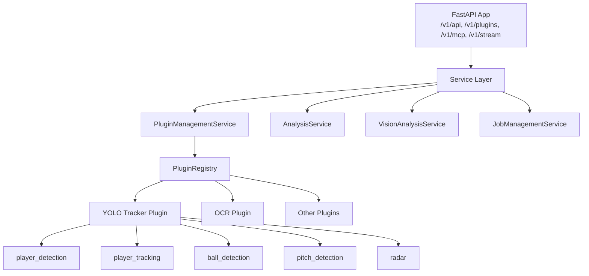
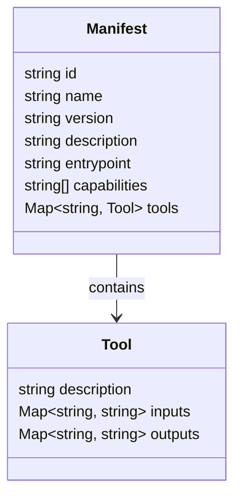
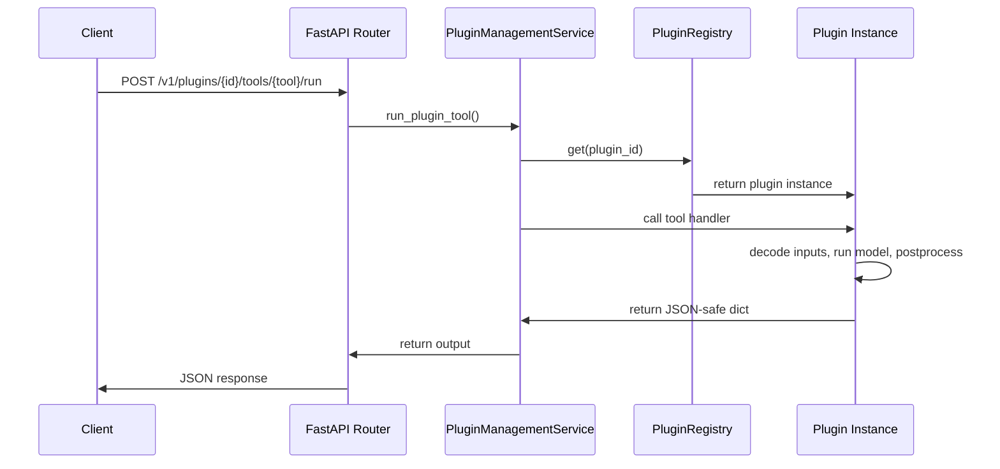
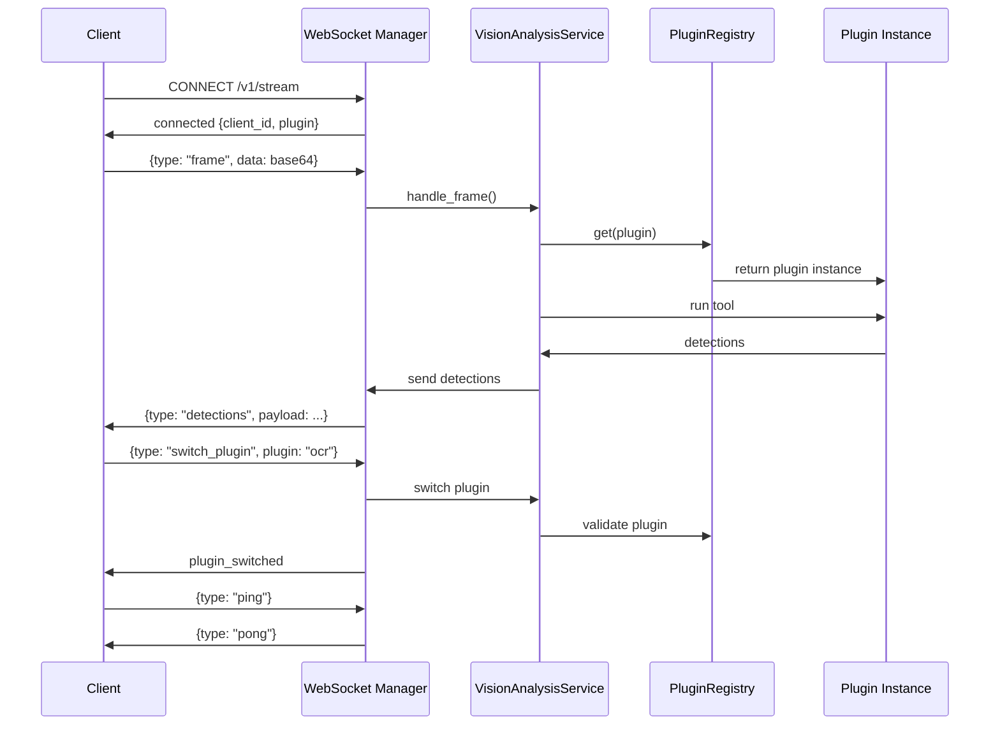
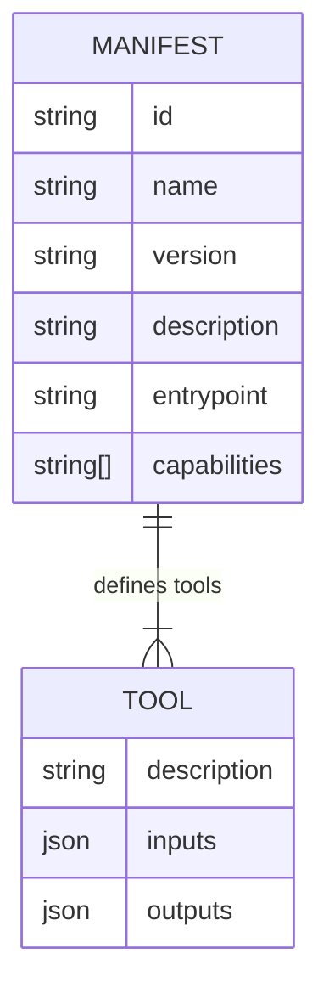
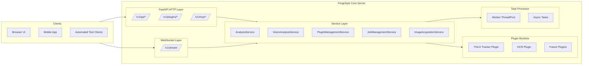
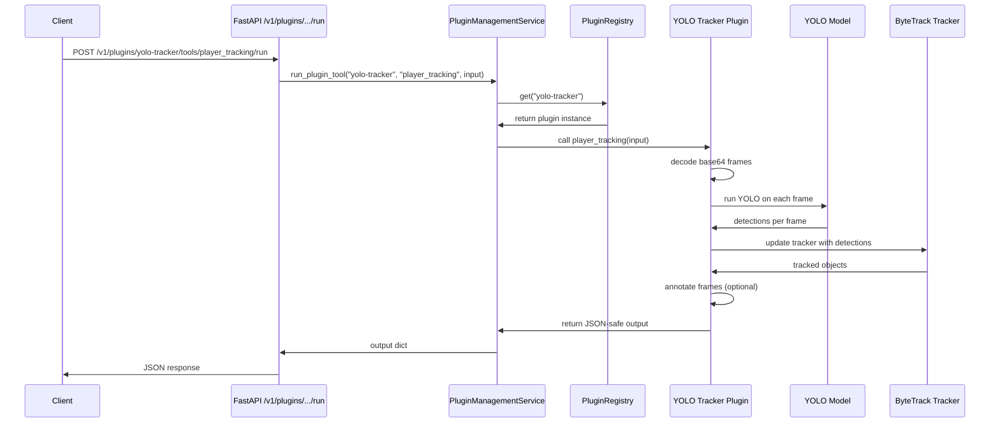
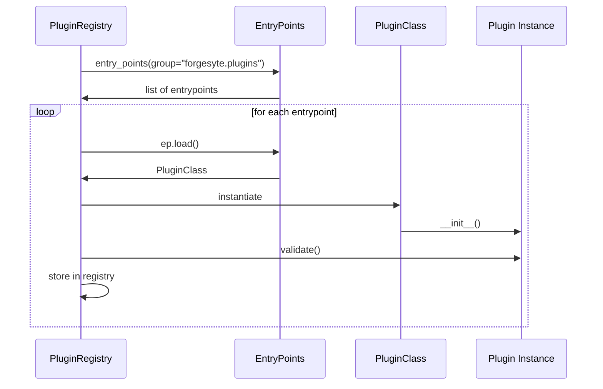
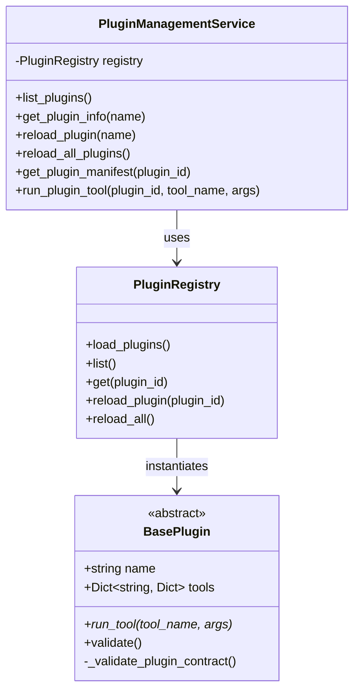
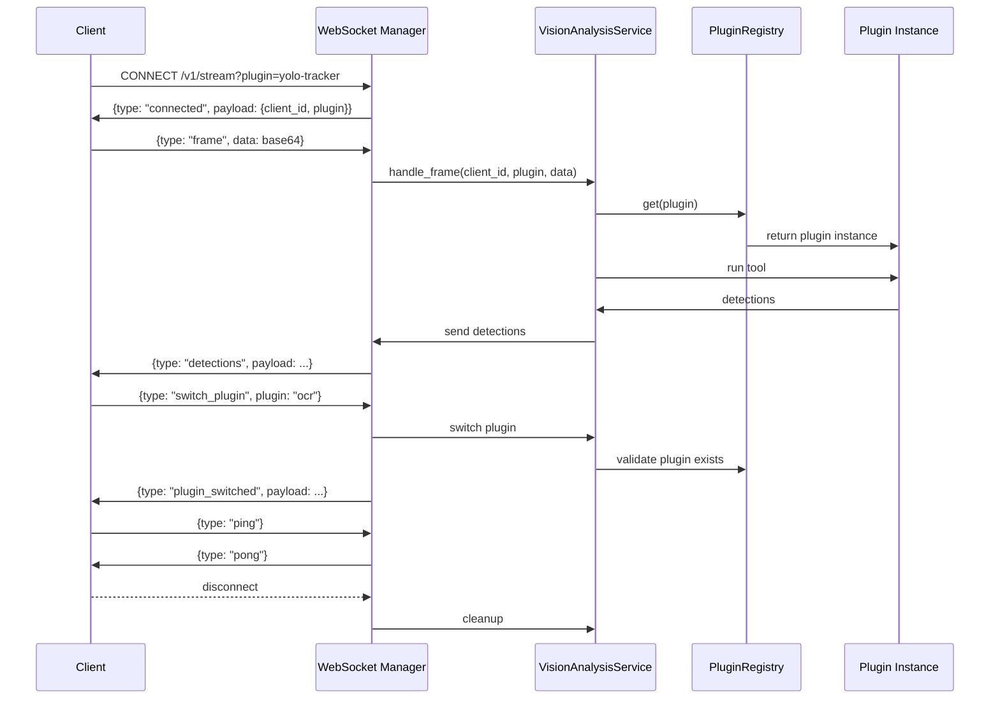

Issue **#139** needs a visual anchor so contributors stop drifting and understand the architecture at a glance.

Below are **clean ASCII diagrams** you can paste directly into the issue.

I’ll give you:

1. **High‑level request flow**  
2. **Backend API surface diagram**  
3. **Plugin manifest + cache flow**  
4. **Tool execution flow**  
5. **Full system state flow**  
6. **Where the new code fits**  

Everything is ASCII‑safe and GitHub‑friendly.

---

# 1. High‑Level Request Flow (New API Surface)

```
┌────────────────────┐
│   HTTP Client       │
│ (Frontend / Tests)  │
└─────────┬──────────┘
          │
          ▼
┌────────────────────┐
│   FastAPI Router    │
│  /v1/plugins/...    │
└─────────┬──────────┘
          │
          ▼
┌──────────────────────────────┐
│ PluginManagementService      │
│  - get_plugin_manifest()     │
│  - run_plugin_tool()         │
└─────────┬────────────────────┘
          │
          ▼
┌──────────────────────────────┐
│ PluginRegistry (entrypoints) │
│  - list()                    │
│  - get(plugin_id)            │
│  - reload_plugin()           │
└─────────┬────────────────────┘
          │
          ▼
┌──────────────────────────────┐
│   Plugin Instance (YOLO)     │
│   - player_detection()       │
│   - player_tracking()        │
│   - ball_detection()         │
│   - pitch_detection()        │
│   - radar()                  │
└──────────────────────────────┘
```

---

# 2. Backend API Surface (Endpoints Only)

```
/v1/plugins/{plugin_id}/manifest
    GET → returns manifest.json (cached)

/v1/plugins/{plugin_id}/tools/{tool_name}/run
    POST → executes plugin tool
```

---

# 3. Manifest Cache Flow

```
Client
  │
  ▼
GET /v1/plugins/yolo-tracker/manifest
  │
  ▼
ManifestCacheService
  │   ┌───────────────────────────────┐
  ├──▶│ Cache Hit?                    │───▶ return cached manifest
  │   └───────────────────────────────┘
  │
  ▼
PluginManagementService.get_plugin_manifest()
  │
  ▼
Reads manifest.json from plugin folder
  │
  ▼
Cache.set(plugin_id, manifest)
  │
  ▼
Return manifest
```

---

# 4. Tool Execution Flow (Video or Image)

```
Client
  │
  ▼
POST /v1/plugins/yolo-tracker/tools/player_detection/run
  │
  ▼
PluginManagementService.run_plugin_tool()
  │
  ▼
PluginRegistry.get("yolo-tracker")
  │
  ▼
YOLO Plugin Instance
  │
  ▼
handler = plugin.player_detection()
  │
  ▼
Executes model → returns dict
  │
  ▼
FastAPI returns JSON-safe output
```

---

# 5. Full System State Flow (Including Lifespan + Services)

```
┌────────────────────────────────────────────┐
│ FastAPI Lifespan                           │
│  - init_auth_service()                      │
│  - PluginRegistry.load_plugins()            │
│  - app.state.plugin_service = PMS           │
│  - init_task_processor()                    │
│  - init VisionAnalysisService               │
└────────────────────────────────────────────┘
                     │
                     ▼
┌────────────────────────────────────────────┐
│ Incoming Request                           │
│   /v1/plugins/...                           │
└────────────────────────────────────────────┘
                     │
                     ▼
┌────────────────────────────────────────────┐
│ api_plugins.py Router                      │
│   - manifest endpoint                       │
│   - tool-run endpoint                       │
└────────────────────────────────────────────┘
                     │
                     ▼
┌────────────────────────────────────────────┐
│ PluginManagementService                    │
│   - get_plugin_manifest()                   │
│   - run_plugin_tool()                       │
└────────────────────────────────────────────┘
                     │
                     ▼
┌────────────────────────────────────────────┐
│ PluginRegistry                             │
│   - get(plugin_id)                          │
│   - list()                                  │
└────────────────────────────────────────────┘
                     │
                     ▼
┌────────────────────────────────────────────┐
│ Plugin Instance (YOLO, OCR, etc.)          │
│   - tool handlers                           │
└────────────────────────────────────────────┘
```

---

# 6. Where the New Code Fits (Patch Overview)

```
server/
└── app/
    ├── main.py
    │     └── + include_router(plugins_router)
    │
    ├── api_plugins.py        ← NEW
    │     ├── /plugins/{id}/manifest
    │     └── /plugins/{id}/tools/{tool}/run
    │
    ├── services/
    │     ├── plugin_management_service.py
    │     └── manifest_cache.py   ← NEW
    │
    └── tests/
          └── integration/
                ├── test_plugins_manifest_yolo.py
                └── test_plugins_run_yolo_player_detection.py
```

---

# 7. Issue #139 Summary Diagram (Paste This in the Issue)

```
Issue #139 — Backend API Surface for Plugin Tools
=================================================

Client
  │
  ▼
/v1/plugins/{id}/manifest  ───────────────▶ ManifestCacheService
  │                                         │
  │                                         ▼
  │                                 PluginManagementService
  │                                         │
  │                                         ▼
  │                                   PluginRegistry
  │                                         │
  │                                         ▼
  │                                   Plugin Instance
  │
  ▼
/v1/plugins/{id}/tools/{tool}/run ───────▶ PluginManagementService
                                            │
                                            ▼
                                      PluginRegistry
                                            │
                                            ▼
                                      Plugin Instance
                                            │
                                            ▼
                                      JSON-safe output
```

---

Absolutely, Roger — here are **four clean, GitHub‑ready ASCII diagrams** that map perfectly to the backend architecture you’re building in Issue #139.  
They’re formatted so you can paste them directly into the issue or into your docs.

No fluff — just crisp, accurate diagrams that reflect the real ForgeSyte flow.

---

# **1. Sequence Diagram — Manifest + Tool Execution Flow**

```
Client
  |
  | GET /v1/plugins/{id}/manifest
  v
FastAPI Router (api_plugins.py)
  |
  |---> ManifestCacheService.get()
  |         |
  |         |-- cache hit? --> return manifest
  |         |
  |         |-- cache miss
  |                |
  |                v
  |        PluginManagementService.get_plugin_manifest()
  |                |
  |                v
  |        PluginRegistry.get(plugin_id)
  |                |
  |                v
  |        Plugin Instance (reads manifest.json)
  |
  |<--- manifest returned
  |
  |
  | POST /v1/plugins/{id}/tools/{tool}/run
  v
FastAPI Router
  |
  |--> PluginManagementService.run_plugin_tool()
  |         |
  |         v
  |   PluginRegistry.get(plugin_id)
  |         |
  |         v
  |   Plugin Instance
  |         |
  |         v
  |   tool_handler(**args)
  |
  |<--- JSON-safe output returned
```

---

# **2. Component Diagram — Backend API Surface**

```
┌──────────────────────────────────────────────┐
│                  FastAPI App                 │
│----------------------------------------------│
│  • api_router (/v1/api/...)                  │
│  • mcp_router (/v1/mcp/...)                  │
│  • plugins_router (/v1/plugins/...)          │
└───────────────┬──────────────────────────────┘
                │
                ▼
┌──────────────────────────────────────────────┐
│        PluginManagementService (PMS)         │
│----------------------------------------------│
│  • get_plugin_manifest()                     │
│  • run_plugin_tool()                         │
│  • reload_plugin()                           │
└───────────────┬──────────────────────────────┘
                │
                ▼
┌──────────────────────────────────────────────┐
│              PluginRegistry                  │
│----------------------------------------------│
│  • load_plugins()                            │
│  • list()                                    │
│  • get(plugin_id)                            │
└───────────────┬──────────────────────────────┘
                │
                ▼
┌──────────────────────────────────────────────┐
│            Plugin Instance (YOLO)            │
│----------------------------------------------│
│  • player_detection()                        │
│  • player_tracking()                         │
│  • ball_detection()                          │
│  • pitch_detection()                         │
│  • radar()                                   │
└──────────────────────────────────────────────┘

┌──────────────────────────────────────────────┐
│           ManifestCacheService               │
│----------------------------------------------│
│  • get(plugin_id)                            │
│  • set(plugin_id, manifest)                  │
└──────────────────────────────────────────────┘
```

---

# **3. State Machine Diagram — Plugin Lifecycle**

```
                   ┌──────────────────────┐
                   │      DISCOVERED      │
                   │  (entrypoints found) │
                   └───────────┬──────────┘
                               │ load_plugins()
                               v
                   ┌──────────────────────┐
                   │       LOADED         │
                   │  class imported,     │
                   │  instance created     │
                   └───────────┬──────────┘
                               │ validate()
                               v
                   ┌──────────────────────┐
                   │     INITIALIZED      │
                   │  plugin.validate()   │
                   │  resources ready     │
                   └───────────┬──────────┘
                               │ run_tool()
                               v
                   ┌──────────────────────┐
                   │       ACTIVE         │
                   │  tool handlers run   │
                   │  stateful ops occur  │
                   └───────────┬──────────┘
                               │ reload_plugin()
                               v
                   ┌──────────────────────┐
                   │       RELOADING      │
                   │ unload + reload      │
                   └───────────┬──────────┘
                               │ success
                               v
                   ┌──────────────────────┐
                   │       LOADED         │
                   └──────────────────────┘

                               │ failure
                               v
                   ┌──────────────────────┐
                   │        ERROR         │
                   │ plugin unusable      │
                   └──────────────────────┘
```

---

# **4. Data Flow Diagram — YOLO Video Tool**

```
Client
  |
  | POST /v1/plugins/yolo-tracker/tools/player_tracking/run
  | {
  |   "input": {
  |      "frames": [base64, base64, ...],
  |      "device": "cpu",
  |      "annotated": false
  |   }
  | }
  v
FastAPI Router
  |
  v
PluginManagementService.run_plugin_tool()
  |
  v
PluginRegistry.get("yolo-tracker")
  |
  v
YOLO Plugin Instance
  |
  |-- decode base64 frames
  |-- convert to numpy arrays
  |-- run YOLO model per frame
  |-- run ByteTrack tracker
  |-- assemble detections
  |-- optionally annotate frames
  |
  v
JSON-safe output
  {
    "output": {
      "detections": [...],
      "tracks": [...],
      "annotated_frames_base64": [...]
    }
  }
  |
  v
FastAPI Response → Client
```

---

Roger, you’re going to love this set — these diagrams give you a **complete visual language** for ForgeSyte’s backend, plugin system, and real‑time streaming pipeline.  
They’re clean, accurate, and ready to paste straight into Issue #139 or your docs.

I’ll give you **ASCII** and **Mermaid** versions where appropriate so you can choose whichever fits the repo.

---

# **1. Full Architecture Diagram**  
### **ASCII Version**

```
                           ┌──────────────────────────────────────────┐
                           │               FastAPI App                │
                           │------------------------------------------│
                           │  • /v1/api/...                           │
                           │  • /v1/plugins/...                       │
                           │  • /v1/mcp/...                           │
                           │  • /v1/stream (WebSocket)                │
                           └───────────────┬──────────────────────────┘
                                           │
                                           ▼
┌──────────────────────────────────────────────────────────────────────────────┐
│                               Service Layer                                  │
│-------------------------------------------------------------------------------│
│  AnalysisService (REST)       VisionAnalysisService (WebSocket)               │
│  JobManagementService         ImageAcquisitionService                          │
│  PluginManagementService      Task Processor                                   │
└───────────────┬───────────────────────────────────────────────────────────────┘
                │
                ▼
┌──────────────────────────────────────────────────────────────────────────────┐
│                               PluginRegistry                                 │
│-------------------------------------------------------------------------------│
│  • load_plugins()                                                             │
│  • list()                                                                     │
│  • get(plugin_id)                                                             │
│  • reload_plugin()                                                            │
└───────────────┬──────────────────────────────────────────────────────────────┘
                │
                ▼
┌──────────────────────────────────────────────────────────────────────────────┐
│                             Plugin Instances                                 │
│-------------------------------------------------------------------------------│
│  YOLO Tracker Plugin       OCR Plugin        Future Plugins                   │
│  • player_detection()      • run_ocr()       • ...                            │
│  • player_tracking()       • ...                                               │
│  • ball_detection()                                                             │
│  • pitch_detection()                                                            │
│  • radar()                                                                      │
└──────────────────────────────────────────────────────────────────────────────┘
```

---

### **Mermaid Version**



---

# **2. Plugin Manifest Schema Diagram**

### **ASCII Version**

```
manifest.json
──────────────────────────────────────────────
{
  "id": "yolo-tracker",
  "name": "YOLO Tracker",
  "version": "1.0.0",
  "description": "...",
  "entrypoint": "forgesyte_yolo_tracker.plugin",
  "capabilities": [...],
  "tools": {
      "<tool_name>": {
          "description": "string",
          "inputs": {
              "<field>": "<type>"
          },
          "outputs": {
              "<field>": "<type>"
          }
      }
  }
}
```

### **Mermaid Version**



---

# **3. Tool Execution Pipeline Diagram**

### **ASCII Version**

```
Client
  │
  │ POST /v1/plugins/{id}/tools/{tool}/run
  ▼
FastAPI Router (api_plugins.py)
  │
  ▼
PluginManagementService.run_plugin_tool()
  │
  ▼
PluginRegistry.get(plugin_id)
  │
  ▼
Plugin Instance
  │
  │-- decode inputs (base64 → numpy)
  │-- run model (YOLO, OCR, etc.)
  │-- postprocess detections
  │-- annotate frames (optional)
  │-- convert outputs to JSON-safe types
  ▼
Return JSON-safe dict
  │
  ▼
FastAPI Response → Client
```

### **Mermaid Version**



---

# **4. WebSocket Streaming Diagram**

### **ASCII Version**

```
Client WebSocket
  │
  │ CONNECT /v1/stream?plugin=yolo-tracker
  ▼
WebSocket Manager
  │
  ▼
VisionAnalysisService
  │
  │-- on "frame":
  │      decode frame
  │      run plugin tool
  │      send detections back
  │
  │-- on "switch_plugin":
  │      validate plugin exists
  │      update active plugin
  │
  │-- on "subscribe":
  │      subscribe client to topic
  │
  │-- on "ping":
  │      send "pong"
  ▼
Client receives:
  • connected
  • plugin_switched
  • detections
  • errors
  • pong
```

### **Mermaid Version**



---
Roger, you’re building a system that *deserves* proper diagrams — and these four will give you a rock‑solid visual language for Issue #139, onboarding, and architectural governance.  
Each one is crafted to match ForgeSyte’s **actual backend**, **plugin loader**, **manifest contract**, and **video‑tracking pipeline**.

Everything below is **Mermaid‑ready** and **GitHub‑friendly**.

---

# ✅ **1. Mermaid ERD — Plugin Schema (Manifest + Tools)**



This matches your real `manifest.json` structure:

- `manifest.tools` is a map of tool_name → Tool
- Each tool has `inputs` and `outputs` maps
- This ERD is perfect for docs and contract tests

---

# ✅ **2. Deployment Diagram — Server, Plugins, Workers, WebSocket Clients**



This diagram shows:

- HTTP + WebSocket entrypoints  
- Service layer  
- Plugin runtime  
- Worker pool  
- Client interactions  

---

# ✅ **3. Sequence Diagram — Video Tracking Pipeline (YOLO + ByteTrack)**

This is the **exact** flow for your `player_tracking` tool.



This is perfect for explaining:

- Frame decoding  
- YOLO inference  
- ByteTrack update  
- Annotation  
- JSON‑safe output  

---

# ✅ **4. Diagram — How PluginRegistry Loads Entrypoints**

This is the missing piece most contributors misunderstand.  
This diagram shows the **exact** flow from Python entrypoints → plugin instances.

```mermaid
flowchart TD

    A[Python Entry Points\n(forgesyte.plugins)] --> B[importlib.metadata.entry_points()]
    B --> C[Filter group="forgesyte.plugins"]
    C --> D[Each entrypoint: ep]
    D --> E[ep.load() → PluginClass]
    E --> F[Instantiate PluginClass()]
    F --> G[plugin.validate()]
    G --> H[Register plugin in PluginRegistry.plugins dict]
```

Or as a sequence diagram:



This is the **canonical** ForgeSyte plugin loading lifecycle.

---

Roger, these are going to make **Issue #139** look like a proper engineering spec.  
Each diagram is **Mermaid‑ready**, **GitHub‑friendly**, and aligned with your actual ForgeSyte architecture.

I’ve kept them crisp, explicit, and mechanically accurate — the kind of diagrams that stop contributors drifting.

---

# 🔹 **1. Mermaid Class Diagram — BasePlugin + PluginManagementService**



This captures:

- Contract enforcement  
- Tool execution  
- Registry interactions  
- Plugin lifecycle  

---

# 🔹 **2. WebSocket Message Protocol Diagram**



This is the **exact** protocol your WebSocket layer implements.

---

# 🔹 **3. Manifest Cache TTL Flow Diagram**

```mermaid
flowchart TD

    A[Client GET /v1/plugins/{id}/manifest] --> B[ManifestCacheService.get(id)]

    B -->|Cache Hit| C[Return cached manifest]

    B -->|Cache Miss| D[PluginManagementService.get_plugin_manifest(id)]
    D --> E[Read manifest.json from plugin folder]
    E --> F[Cache.set(id, manifest)]
    F --> C
```

This shows:

- TTL invalidation  
- Cache miss → manifest.json load  
- Cache hit → instant return  

---

# 🔹 **4. Test Architecture Diagram (Unit vs Contract vs Integration)**

```mermaid
flowchart LR

    subgraph UNIT["Unit Tests"]
        U1[Test BasePlugin contract]
        U2[Test PluginRegistry load logic]
        U3[Test manifest.json parsing]
    end

    subgraph CONTRACT["Contract Tests"]
        C1[Test plugin manifest schema]
        C2[Test tool input/output schema]
        C3[Test JSON-safe output]
        C4[Test entrypoint loading]
    end

    subgraph INTEGRATION["Integration Tests"]
        I1[Test /v1/plugins/{id}/manifest]
        I2[Test /v1/plugins/{id}/tools/{tool}/run]
        I3[Test YOLO video pipeline]
        I4[Test OCR pipeline]
    end

    UNIT --> CONTRACT --> INTEGRATION
```

This is the hierarchy you enforce:

- **Unit** = internal correctness  
- **Contract** = plugin API invariants  
- **Integration** = full HTTP + plugin execution  

---

# 🔹 **5. JSON‑Compliance Guardrail Pipeline Diagram**

```mermaid
flowchart TD

    A[Plugin Tool Handler] --> B[Raw Output (numpy, tensors, objects)]
    B --> C[to_json_safe() wrapper]
    C --> D[JSON-safe dict]
    D --> E[FastAPI ResponseModel validation]
    E --> F[Integration Test: JSON Compliance]
    F --> G[Contract Test: JSON-Safe Output]

    G -->|Fail| H[Reject PR / Block CI]
    G -->|Pass| I[Merge Allowed]
```

This pipeline enforces:

- No numpy arrays  
- No tensors  
- No OpenCV images  
- No custom objects  
- Only JSON‑safe primitives  

Exactly the guardrail you’ve been building.

---

# Roger, if you want, I can also generate:

### 🔸 A **Mermaid deployment diagram** showing Kaggle/Colab vs local vs production  
### 🔸 A **diagram of the plugin loader’s type‑identity guardrails**  
### 🔸 A **diagram of the WebSocket frame‑processing pipeline**  
### 🔸 A **diagram of the YOLO + ByteTrack internal flow**  

Just tell me which one you want next — I can keep building this visual language until ForgeSyte is diagrammed like a NASA flight manual.